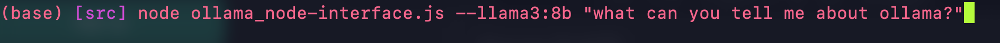
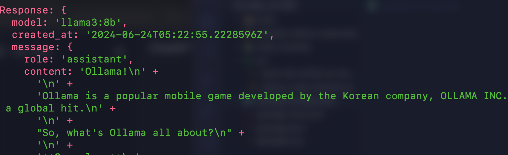

# Llama Node.js Terminal Interface
This is a small node script to interface an Ollama server in the terminal, while also saving responses locally as timestamped JSON files. You can provide flags for different models, including Llava-phi3:latest, Codellama:7b, and Llama3:8b.

The Ollama endpoint present is just for example purposes and not intended for public use, though if you'd like to collaborate on a project with my hardware, feel free to get in touch.

## Downloading and configuring the project
To run the project, follow these steps:
1. Install Node.js and npm if you haven't already.
2. Clone this repo to your local machine using `git clone`.
3. Navigate to the cloned repo folder in your terminal or command prompt.
4. Change the Ollama endpoint to your own endpoint, or reach out for access to llm.kristiantalley.com.

## Interact with Ollama in the terminal
To interact with Ollama in the termina, follow these steps:
1. Open a terminal or command prompt and navigate to the cloned repo folder.
2. Navigate to the src/ directory and Run `node ollama_node-interface.js --{modelname} "{your message to the model}"` where `{modelname}` is the name of the model you want to use and `{your message to the model}` is the message you want to send to the model.
3. If no `--model` flag is provided, the default model is llava-phi3:latest.
4. You'll receive an error if no message is provided.
5. Responses are saved in the same src project folder.

### Available models
The following models are currently available for use with this project:
* `llama-phi3:latest` (default)
* `codellama:7b`
* `llama3:8b`
You can specify any of these models using the `--model` flag, e.g., `npm start -- --model llava-phi3:latest`.

### To do: chaining prompts
Currently, the project only supports one prompt at a time. This will be updated in the future.
{
  "input": [1, 2, 3],
  "model": "llama-phi3:latest"
}
